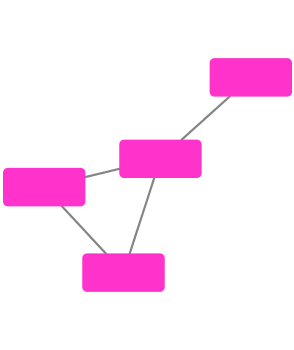
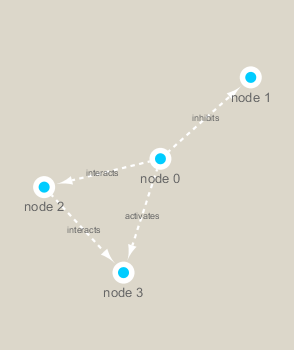

```{r setup, include=FALSE}
knitr::opts_chunk$set(echo = TRUE)
```


```{r}
df <- data.frame(1:5, 1:5)
df
```


```{r}
BiocManager::install("RCy3")
```

```{r}
library(RCy3)
library(igraph)
library(RColorBrewer)
```


```{r}
cytoscapePing()
```


```{r}
g <- makeSimpleIgraph()
createNetworkFromIgraph(g,"myGraph")
```


```{r}
plot(g)
```

```{r}
fig <- exportImage(filename="demo", type="png", height=350)
```

```{r}

```


```{r}
setVisualStyle("Marquee")
```

```{r}
fig <- exportImage(filename="demo_marquee", type="png", height=350)


```

```{r}
## scripts for processing located in "inst/data-raw/"
prok_vir_cor <- read.delim("virus_prok_cor_abundant.tsv", stringsAsFactors = FALSE)

## Have a peak at the first 6 rows
head(prok_vir_cor)
```

```{r}
g2 <- graph.data.frame(prok_vir_cor, directed = FALSE)
```

```{r}
g2
```

```{r}
plot(g2)
```

```{r}
plot(g2, vertex.label=NA)
```

```{r}
plot(g2, vertex.size=3, vertex.label=NA)
```

