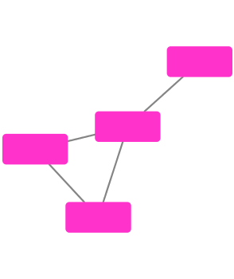
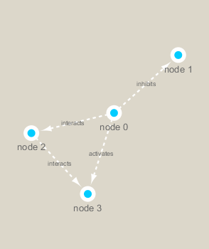

Class17
================

``` r
df <- data.frame(1:5, 1:5)
df
```

    ##   X1.5 X1.5.1
    ## 1    1      1
    ## 2    2      2
    ## 3    3      3
    ## 4    4      4
    ## 5    5      5

``` r
BiocManager::install("RCy3")
```

    ## Bioconductor version 3.10 (BiocManager 1.30.9), R 3.6.1 (2019-07-05)

    ## Installing package(s) 'RCy3'

    ## package 'RCy3' successfully unpacked and MD5 sums checked
    ## 
    ## The downloaded binary packages are in
    ##  C:\Users\Kevin Banh\AppData\Local\Temp\RtmpmMFvF2\downloaded_packages

    ## Installation path not writeable, unable to update packages: boot, foreign,
    ##   KernSmooth, Matrix, mgcv, nlme, survival

    ## Old packages: 'backports', 'bio3d', 'BiocManager', 'callr', 'carData',
    ##   'clipr', 'curl', 'dendextend', 'devtools', 'digest', 'ellipsis',
    ##   'factoextra', 'FactoMineR', 'ggpubr', 'ggsignif', 'haven', 'Hmisc',
    ##   'hms', 'htmlTable', 'httr', 'igraph', 'IRanges', 'knitr', 'maptools',
    ##   'network', 'openssl', 'pkgbuild', 'pkgconfig', 'processx', 'purrr',
    ##   'quantreg', 'R.utils', 'R6', 'Rcpp', 'RcppEigen', 'rlang', 'rmarkdown',
    ##   'roxygen2', 'RSQLite', 'S4Vectors', 'scales', 'sp', 'sys', 'testthat',
    ##   'tidyr', 'tinytex', 'whisker', 'xfun', 'xml2'

``` r
library(RCy3)
library(igraph)
```

    ## 
    ## Attaching package: 'igraph'

    ## The following objects are masked from 'package:stats':
    ## 
    ##     decompose, spectrum

    ## The following object is masked from 'package:base':
    ## 
    ##     union

``` r
library(RColorBrewer)
```

``` r
#g <- makeSimpleIgraph()
#createNetworkFromIgraph(g,"myGraph")
```

``` r
#plot(g)
```

``` r
#fig <- exportImage(filename="demo", type="png", height=350)
```

``` r

```

<!-- -->

``` r
#setVisualStyle("Marquee")
```

``` r
#fig <- exportImage(filename="demo_marquee", type="png", height=350)

#
```

``` r
## scripts for processing located in "inst/data-raw/"
prok_vir_cor <- read.delim("virus_prok_cor_abundant.tsv", stringsAsFactors = FALSE)

## Have a peak at the first 6 rows
head(prok_vir_cor)
```

    ##       Var1          Var2    weight
    ## 1  ph_1061 AACY020068177 0.8555342
    ## 2  ph_1258 AACY020207233 0.8055750
    ## 3  ph_3164 AACY020207233 0.8122517
    ## 4  ph_1033 AACY020255495 0.8487498
    ## 5 ph_10996 AACY020255495 0.8734617
    ## 6 ph_11038 AACY020255495 0.8740782

``` r
g2 <- graph.data.frame(prok_vir_cor, directed = FALSE)
```

``` r
g2
```

    ## IGRAPH 054c2ae UNW- 845 1544 -- 
    ## + attr: name (v/c), weight (e/n)
    ## + edges from 054c2ae (vertex names):
    ##  [1] ph_1061 --AACY020068177 ph_1258 --AACY020207233
    ##  [3] ph_3164 --AACY020207233 ph_1033 --AACY020255495
    ##  [5] ph_10996--AACY020255495 ph_11038--AACY020255495
    ##  [7] ph_11040--AACY020255495 ph_11048--AACY020255495
    ##  [9] ph_11096--AACY020255495 ph_1113 --AACY020255495
    ## [11] ph_1208 --AACY020255495 ph_13207--AACY020255495
    ## [13] ph_1346 --AACY020255495 ph_14679--AACY020255495
    ## [15] ph_1572 --AACY020255495 ph_16045--AACY020255495
    ## + ... omitted several edges

``` r
plot(g2)
```

<!-- -->

``` r
plot(g2, vertex.label=NA)
```

<!-- -->

``` r
plot(g2, vertex.size=3, vertex.label=NA)
```

<!-- -->
